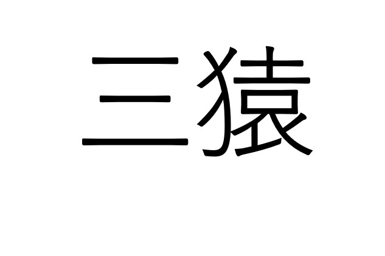

# San Saru: selección natural de equipos
Por Thomas Wallet, @WalletThomas y Tomás Christie, @tommychristie

## Palabras clave

auto-organización, descentralización, propuesta de valor, selección, san saru

## Intención

En abril del 2015 se realizó el primer _Agile Open Camp_ (AOC), cuyos tres fundadores (Mauro Strione, Tomás Christie y Thomas Wallet) no tenían experiencia alguna en organización de eventos.

Si bien fueron rápidamente respaldados por otros organizadores más experimentados, se pusieron a la venta 50 entradas con poca expectativa de venderlas. A pesar del período de fiestas de fin de año y vacaciones de verano, a las 3 semanas se habían agotado todas las entradas. Luego, se habilitó la venta de 25 entradas más al doble de precio, que se agotaron en menos de una semana. Cuando finalmente se cerraron las inscripciones, quedaron más de 30 personas en lista de espera.

Para la segunda edición del AOC se amplió la capacidad a 100 personas y desde las primeras charlas de organización, surgió la preocupación de evitar una selección de participantes basada en una carrera contra-reloj por comprar entradas.

Durante otro evento de la comunidad ágil [Ágiles 2015], se formó un pequeño grupo luego de las actividades del día, que debatió apasionadamente para revisar ideas previas y explorar alternativas superadoras al mecanismo anterior de inscripción. Tomando como base una idea original de Mauro Strione de selección distribuida logramos entre todos asentar las bases del mecanismo de inscripción _San Saru,_ que se describe más adelante.

## Motivación

Partiendo del supuesto que la demanda de entradas para el AOC iba a superar ampliamente la cantidad disponible, se diseñó el mecanismo de inscripción llamado _San Saru_ con el objetivo de cumplir con las siguientes características:

*   **Descentralizado,** para que la selección no dependa de un comité restringido.
*   **Activo,** para que los interesados tengan que exponer sus motivaciones.
*   **Abierto,** para que los criterios de selección no sean pre-definidos ni cerrados.
*   **Asincrónico,** para poder ejecutar en paralelo sus distintas etapas.

## Descripción

### Metafora San Saru

_San Saru_ es un término japonés que se puede traducir como “los tres monos sabios”. Entre las múltiples explicaciones existentes del concepto, destacamos la siguiente [Román 2006]:

Cuenta la leyenda que tres monos fueron enviados por los dioses para delatar y castigar las malas acciones de los humanos:

* _Kikazaru,_ el mono sordo, era el encargado de utilizar el sentido de la vista para observar a quienes realizaban malas acciones y comunicárselo a Mizaru, mediante la voz.
* _Mizaru,_ el mono ciego, no necesitaba su sentido de la vista, puesto que tan sólo se encargaba de transmitir al tercer mono, Iwazaru, los mensajes que le pasaba Kikazaru.
* _Iwazaru,_ el mono mudo, escuchaba los mensajes transmitidos por Mizaru para decidir la pena de los dioses que le caería al desafortunado humano que lo mereciese y observar que se cumpliese.

Colocados los tres monos según sus habilidades y limitaciones, obtenemos un mono que ve, otro que escucha y otro que habla. Los monos, juntos y organizados, pueden alcanzar metas que no lograrían por separado. Si bien existen varias posibilidades de colocar a los tres monos, todas ellas son situaciones de comunicación fallida o de colaboración imposible, excepto una: _Kikazaru_ (sordo) > _Mizaru_ (ciego) > _Iwazaru_ (mudo).

La metáfora San Saru, con su fundamento de integración por afinidad y complementariedad, inspiró el mecanismo de inscripción del AOC, con sus dos etapas: **postulación** y **selección.**

### La postulación

Se solicita a los interesados en participar del AOC postularse, contestando las siguientes preguntas:

*   **¿Qué puedo aportar yo al evento?** ¿Por qué el evento va a ser mejor con mi participación?
*   **¿Qué espero recibir del evento?** ¿En qué creo que me va a ayudar?
*   **¿Quién soy?** ¿Cuál es mi ocupación, formación, empresa/institución, pasión, etc.?

Todas las postulaciones son públicas.

### La selección

El **San Saru Primario,** compuesto por los tres fundadores del AOC inicia la selección de los participantes.

Cada uno de los tres miembros del **San Saru Primario** elige a dos personas postuladas para formar un nuevo **San Saru Secundario,** con las siguientes restricciones:

*   **Mis propios criterios:** cada persona elige dos participantes evaluando las postulaciones para que el evento sea el mejor posible de acuerdo a sus propios criterios.
*   **Una persona desconocida:** se sugiere elegir por lo menos una postulación de una persona que no sea compañero de trabajo, de estudio, o cercano por otra vía, para evitar el sesgo de pertenencia.

Se comunica a las nuevas personas elegidas su selección, lo cual habilita, por un lado su inscripción al evento, y por otro lado su responsabilidad de generar un nuevo **San Saru Terciario,** eligiendo dos personas cada una dentro de las postulaciones restantes.

**_Figura 1.1._** _Ejemplos de San Saru Primario, Secundario y Terciario._

Se repite el ciclo hasta generar todos los San Saru necesarios para cubrir las vacantes disponibles con las personas seleccionadas. Si bien la etapa de postulación se inicia un tiempo antes que la etapa de selección, una vez iniciada la etapa de selección las dos se desarrollan en paralelo hasta agotar las vacantes disponibles.

### Resultados

El primer experimento de inscripcion San Saru para el _Agile Open Camp 2016_ [AOC 2016] arrojó los siguientes resultados:

*   Se inició la etapa de postulación el 1/12/2015, recibiendo 119 postulaciones hasta el 25/2/2016, de las todas fueron seleccionadas.
*   Se inició la etapa de selección el 23/12/2015, generando 119 selecciones hasta el 26/2/2016, de las cuales 24 personas no se inscribieron o cancelaron su inscripción por motivos varios.

### Conclusión

### (Des)control

Una vez armadas las herramientas de soporte, hechas las explicaciones correspondientes [AOC 2016], y generadas las selecciones del San Saru Primario, el mecanismo San Saru empezó a funcionar por sí solo, sin necesidad de intervención por parte de la organización sobre sus resultados.

Se necesitaron algunas comunicaciones de seguimiento para evitar que los seleccionados demoren su inscripción al evento y/o su elección de postulantes. También se centralizaron en un grupo de 6 personas las tareas de comunicación de los pasos a seguir para la inscripción al evento.

En varias oportunidades surgió la tentación de intervenir para frenar estas comunicaciones para demorar las selecciones posteriores (por ejemplo cuando quedaban pocas postulaciones disponibles para elegir), pero al final no hubo grandes intervenciones por parte de la organización y se dejó fluir solo el mecanismo San Saru.

### Lo que aprendimos

Se diseñó el experimento de inscripciones San Saru para el AOC suponiendo que las entradas habilitadas eran pocas para el público interesado, lo cual no se cumplió: todas las postulaciones fueron elegidas, y sobraron 5 vacantes.

Identificamos algunas oportunidades de mejora:

*   Dejar más tiempo entre el inicio de las postulaciones y el inicio de las selecciones, para lograr mayor volumen de postulaciones.
*   Evitar los meses de diciembre y enero, en los cuales suele haber mucha carga de actividad laboral y personal, dificultando el esfuerzo requerido para las postulaciones.
*   Facilitar las postulaciones de personas con poca experiencia en este tipo de evento o metodologías, ya que expresar el valor que uno puede aportar al evento puede generar cierta inhibición.

El experimento también permitió refinar sobre la marcha varios aspectos logísticos y de comunicación del mismo, lo cual seguramente habilitará futuros usos más fluidos.

A pesar de estas limitaciones, el balance del experimento es positivo. Se destaca en particular lo bien que funcionó la auto-organización, la diversidad y riqueza de los criterios de selección que aportó cada uno, y la sana reflexión de cada postulante para definir sus motivaciones de participación.

Quizás se pueda extrapolar el mecanismo de selección San Saru a otros dominios para los cuales sea útil tener un mecanismo de selección descentralizado y auto-organizado basado en propuestas de valor.