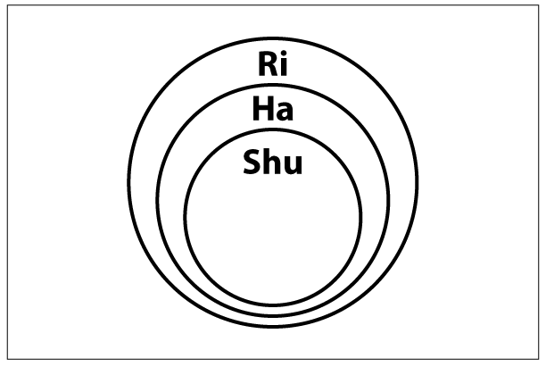

# SHU-HA-RI: Un Modelo de Aprendizaje
Por Omar Fernández, @omarfl7

## Palabras clave

Aprendizaje, mejora continua, shu-ha-ri

## Intención

Cómo enfrentar técnicas nuevas o rescatar las ya conocidas, haciendo énfasis en la búsqueda del aspecto fundamental de éstas, lo esencial, lo que hace de esta técnica singular.

## Motivación

Si te encuentras estudiando y buscando alguna nueva técnica pero buscas ir más allá de sólo aprenderla. Deseas comprender el espíritu de ésta, de forma tal que puedas transportar dicho espíritu en diferentes contextos. Entonces reconocerás que todo proceso de aprendizaje lleva tiempo y pasa por diferentes etapas.

## Descripción

Es posible que hayas escuchado sobre Shu-Ha-Ri como es posible que no, bien sea en el contexto de software o para otro contexto. Podrías revisar el artículo de Martin Fowler [Fowler 2014] para tener un primer acercamiento o el artículo de Alistair Cockburn [Cockburn 2008] para una revisión más extensa en el contexto de software.

Si realizamos una descripción breve, Shu-Ha-Ri es un concepto del arte marcial Japonés que describe las etapas de aprendizaje de un estudiante para lograr la maestría en el arte. Ésta consta de tres etapas cuya descripción es la siguiente:

**Shu**: significa mantener o proteger. En esta etapa el estudiante sigue los pasos indicados por el maestro sin preocuparse demasiado en los aspectos subyacentes de la técnica.

**Ha**: significa separar. En esta etapa el estudiante empieza a aprender los principios y la teoría subyacente detrás de la técnica. El estudiante formulará muchos porqués sobre la técnica.

**Ri**: significa trascender. En esta etapa el alumno ha aprendido la técnica del maestro y empieza un aprendizaje adaptado y creado bajo su propia experiencia. La relación estudiante-alumno ya no es debido al aprendizaje de la técnica sino mucho más cercana, manteniendo la independencia del alumno.

De lo anterior podemos apreciar etapas bien definidas, tareas concretas por etapas y un maestro el cual pueda guiarte. Estas etapas pasan por generar una conciencia en aquello que se practica para en algún momento asimilarlo y mejorarlo. Sin embargo, esto nos lleva a entender que no basta con sólo leer o practicar tempranamente, hay que asimilar su contenido, su fundamento y esencia para poder apreciar el trasfondo de esta práctica. Es decir entenderlo para apreciarlo y mejorarlo. No basta haber leído la biblia para convertirse en santo y en ese sentido y en ese camino, no podemos detenernos y decir que ya lo entendemos si no hemos generado conciencia en ello.

Ciertamente al aprender una técnica no siempre tendremos la compañía de un maestro, lo cual sería bastante importante pero, sin embargo existe un grupo de actitudes que se manifiestan en cada etapa. Las describo a continuación:

**Shu**: en esta etapa temprana es importante practicar mucho y entender lentamente los pasos de la misma forma como si aprendiéramos a caminar. Seguramente no tendremos conciencia clara del porqué de cada paso pero podremos ver coherencia entre paso y paso. En este punto es importante medir y reflexionar, porque nos llevará a la siguiente etapa. El hecho de medir nos ayuda a comparar que tanto hemos avanzado nosotros mismos o con respecto a aquello que queremos lograr con esta práctica.

**Ha**: si ya hemos entendido la técnica, ciertamente podemos desenvolvernos con facilidad, pero se sentirá como quien sigue una receta, y es en este punto donde debemos cuestionar si lo aceptamos o no tal como lo hemos aprendido y entonces nos percatamos que sólo aprender la técnica no basta, la sucesión de pasos uno tras otro tiene un porqué que es importante encontrar y ello nos lleva a buscar e investigar. Si mantenemos dicho espíritu de no simple aceptación y de considerar el aprendizaje como algo no terminado, entonces nos llevará a la siguiente etapa.

**Ri**: aunque parezca extraño es importante olvidar lo aprendido porque estos fueron sólo una secuencia de pasos lógicos pero que no develan el espíritu del mismo. Nos sirvió para aprender la técnica pero en este punto es el velo que no deja ver más allá. El olvidar permite desapegarse de los pasos aprendidos para que poco a poco podamos apreciar que los pasos fueron una forma de mostrar la práctica pero que oculto por debajo se encuentra el espíritu de la misma. El desapego se manifiesta también al retirar los pensamientos que llevan a considerar como única la interpretación de la técnica que hemos aprendido y de esta forma, empezar a aceptar nuevas interpretaciones de la misma como un vaso que puede verse de distintas posiciones. Posiblemente volverás a recorrer los pasos iniciales pero esta vez será como una danza natural, sin esfuerzo, pero que en sí misma muestra el espíritu de la práctica. En este punto se percibirá que se debe seguir aprendiendo, y es entonces cuando estamos comprendiendo el espíritu de la técnica. Ahora es cuando empezaremos a extenderla y visualizarla en múltiples y nuevos contextos

De forma breve podemos identificar en qué etapa nos encontramos apoyándonos en algunas actitudes que mostramos:

1.  Si sigues estrictamente los pasos como una secuencia, bien sea porque recién inicias con la técnica o porque así aprecias que debe ser, estás en Shu.
2.  Si necesitas saber el porqué de dicha secuencia de pasos, y buscas el porqué de los enlaces de los mismos en dicho orden y no en otro, y ensayas o experimentas una y otra vez, estás en Ha.
3.  Si te percatas que empiezas a describir la técnica pero en distintas formas como quien describe un vaso en distintos ángulos pero sin apegarte a esa descripción y comienzas visualizar la misma en otros entornos, entonces estás en Ri.

Otro aspecto importante a tener en cuenta es que cada etapa no es una secuencia lineal sino más bien éstas se auto contienen como se puede ver en la figura siguiente. Pero también en ese sentido vamos incrementando las actitudes que manifestamos y, que en un principio te parecerán contradictorias pero con la práctica te percatarás que éstas se refuerzan entre una y otra.

Puedes considerar encontrarte en alguna etapa, pero las actitudes que manifiestes son las que realmente describirán en qué etapa te encuentras. Esto es un trabajo de autoconciencia que te indicará a tí mismo con qué actitud enfrentas el aprendizaje.

Es usual mantenerse en la etapa Shu y Ha y sentirse conforme, pero es importante llegar a la etapa Ri, en la cual no sólo se aprecia el sentido de una técnica o práctica, sino que también se develan aspectos de ella que la hacen singular, encontrarás patrones y nuevas formas de mejorarla. Apreciarás que el aprendizaje de algo no es un tema terminado sino más bien un camino que se debe seguir recorriendo.

**_Figura 6.1_**_. Relación entre Shu, Ha y Ri_

Además, una misma persona puede estar en distintos estados en cada una de sus destrezas en un instante de tiempo, y, en un equipo, cada integrante puede estar en distintos estados con respecto a una destreza. Por otro lado podríamos hablar del estado de todo el equipo en una destreza o técnica en particular.

### Conclusión

Las tres etapas nos ayudan a reconocer la esencia de una técnica, y, como consecuencia de esto habilitarnos a poder transportar dicho conocimiento a diferentes contextos. Podemos, sí, mantenernos en las dos primeras etapas, pero esto sólo nos mantendrá como conocedores. Pero si deseamos trascender la técnica, deberemos llegar a la tercera.

Algo que también podemos percatarnos es que cada etapa no es un empezar y terminar, sino en la repetición de las etapas anteriores impulsa sutilmente a llegar a la siguiente etapa siempre que no descuidemos **las actitudes que manifestamos**.

Te invito entonces a que selecciones alguna técnica que tal vez consideres ya aprendida o alguna que desees aprender, revises las actitudes que manifiestas y realices éste recorrido sin fin del Shu-Ha-Ri.

Finalmente quisiera dejar una cita tomada de Shunryu Suzuki [Suzuki 1987], la cual he adecuado para este contexto de aprender:

“Nuestra comprensión de una técnica, no es meramente una comprensión intelectual. La verdadera comprensión es la práctica misma”.
