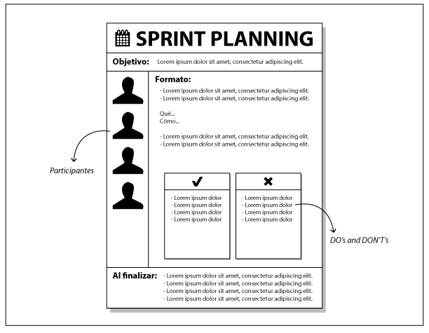
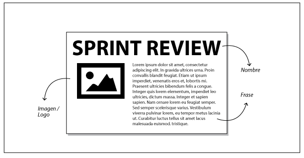

# Prácticas eficaces para aplicar en Reuniones (In)eficientes

Por Alejandro Faguaga, @afaguaga

## Palabras clave

Proyectos ágiles, comunicación efectiva, colaboración, ceremonias, reuniones eficientes

## Intención

En muchas organizaciones la palabra reunión es prácticamente mala palabra, sinónimo de pérdida de tiempo, debido a que las reuniones son ineficientes y poco eficaces.

Esto mal predispone a la gente y genera mucha pérdida de tiempo de las personas.

Presentamos aquí una serie de técnicas o prácticas muy simples pero eficaces que permiten conducir reuniones más eficientes y productivas con un mínimo esfuerzo y organización previa.

## Motivación

### La previa

Supongamos que estamos empezando a acompañar a un equipo en su primer proyecto ágil, dentro de una gran organización tradicional, un gigante que se mueve muy lento.

Todavía no conocemos bien a los participantes del proyecto, pero como esto de “Agile” viene muy “_sponsoreado”_ e impulsado desde arriba, nos empiezan a llegar mails e invitaciones a reuniones compulsivamente.

Una de esas invitaciones dice en el asunto “Revisión de Nuevo Proyecto”. Somos 12 personas invitadas a compartir 2 horas de nuestro tiempo, de las cuales no conozco a casi nadie.

En el cuerpo de la invitación no hay una agenda definida tampoco. La reunión es a la tarde y no sabemos porque nos invitaron, ni para qué, ni quienes van a participar, o mejor dicho qué roles van a desempeñar en el proyecto.

De la extensa lista de nombres nos parece reconocer a una persona y vamos a su escritorio a consultarle cual es el objetivo de la reunión. Nos responde que no tiene idea, pero que debe ser importante porque en la lista de invitados está su jefe y varios líderes de equipos que mantienen sistemas _core_ de la organización. Además que hay varios “pesos pesados” de producto.

Volvemos a nuestro escritorio un tanto desilusionados.

### La reunión

Entramos a la sala, hay 10 personas que no conozco. Sigue llegando gente hasta que claramente hay más personas en la sala de las que había en la invitación.

Llega una mujer que saluda y agradece porque estamos ahí, aún sin saber por qué y para qué. Claramente es la persona que envió la invitación.

Como el objetivo de la reunión y la agenda no están para nada claros, hay varios líderes que “por las dudas” llevaron a un analista y a un desarrollador de su equipo, por si se tratan temas funcionales o técnicos respectivamente. Esto hace que la cantidad de gente crezca desmesuradamente.

Empieza la reunión con todos hacinados en la sala y ocurre el caos, nadie sabía para qué era la reunión específicamente, pero como hay mucha gente invitada, varios aprovecharon para llevar una lista de sus problemas o inquietudes, que mejor que plantearlas en un ámbito donde están varios líderes juntos. Se empiezan a plantear entonces muchos problemas distintos, de forma desorganizada, muchos de ellos no relacionados con nada, ante el estupor del “organizador” que ve cómo su reunión se va por cauces inesperados.

Luego de varias discusiones sin un hilo conductor, el organizador logra encauzar la reunión hacia un tema que si tiene que ver con el proyecto. Para eso ya pasaron 40’ y ya hay varias personas que se dan cuenta que están de más, que no pueden aportar nada y que la reunión tampoco les está dejando gran cosa.

Adicionalmente, nos damos cuenta que para terminar de definir algunas cuestiones, está faltando gente fundamental que no fue invitada.

Pero claro, como la agenda no era explícita, nadie pudo detectar previamente que esas personas iban a ser necesarias.

Ya pasada la hora de reunión empieza la catarsis, producto de la frustración de la mayoría de los asistentes porque en “esa organización siempre pasa lo mismo”, que las “reuniones no sirven para nada”, que “son una pérdida de tiempo”, etc. Hasta que finalmente se cumple el horario y nos piden que entreguemos la sala.

Esto es un claro ejemplo de una extensa reunión de más de dos horas donde se hizo mucha catarsis pero nada productivo, y se plantearon diversos problemas pero ninguna solución. Dos horas de más de 20 personas totalmente estériles.

## Descripción

Para intentar evitar todo lo anterior se pueden implementar una serie de prácticas que nos permitieron optimizar el tiempo de los asistentes, que no les quite las ganas de volver a tener una reunión y que por sobre todo sean simples, eficaces y sencillas de realizar, es decir implementables.

### Prácticas

**Enviar Agenda Visual:** básicamente lo que se propone aquí es definir agendas digitales de manera gráfica para incluir en las invitaciones de las distintas reuniones o ceremonias, ya sean de Scrum o no.

Se muestra en la Figura 7.1 un ejemplo de agenda digital que se podría utilizar para la invitación a una reunión de planificación de Sprint.

Esta práctica permite clarificar varios temas, a saber:

*   Tener un objetivo claro a cumplir en la reunión: explicitar el propósito de la misma.
*   Definir la agenda y el tiempo necesario (Formato de la reunión): que todos sepan exactamente qué vamos a hacer en la reunión y también lo que NO vamos a hacer (una especie de _DOs_ & _DONTs_).
*   Ajustar y precisar la audiencia (participantes): describirla de antemano en forma clara, para que no sobre gente pero también para dar la posibilidad de que si falta alguien los convocados lo puedan plantear de antemano basándose en el objetivo y la agenda de la reunión.
*   Impulsar “el hacer”: describir en la sección final de la agenda digital, lo que no podemos dejar de realizar inmediatamente después de abandonar la reunión (acciones concretas). En nuestro ejemplo de la Figura 7.1 esta sección se denomina llamada “_Al finalizar_…”

Esta práctica además de brindar mucha información útil previa a la reunión, es mucho más efectiva que poner el texto en la agenda de la invitación, ya que por lo general la gente no se detiene a leer el texto (sobre todo si ve que es muy extenso).

**_Figura 7.1.** Plantilla para reuniones de planificación de Sprint_

**Cronomertar las reuniones:** comúnmente en las reuniones dedicamos excesiva cantidad de tiempo a ciertas tareas o discusiones que no llevan a nada productivo por el simple hecho de que las personas pierden la noción del tiempo. Cuando definimos de antemano y de manera conjunta (por ejemplo por votación) el tiempo que le vamos a dedicar a cada actividad de la reunión y además hacemos explícito y visual el paso del tiempo es increíble como la situación cambia. Por ejemplo, en algunas reuniones de _Inception_ hemos definido como equipo que no le dedicaríamos más de 15’ a cada requerimiento para generar las _User Stories_ iniciales. Esto hizo que las personas tomaran conciencia y optimizaran ese tiempo por el simple hecho de ver en un cronómetro el tiempo restante. Esto no significa que pasados los 15 minutos tengamos que terminar si o si la actividad, quizás solo puede servir para tomar conciencia de que estamos excediendo el límite y eso nos quitaría tiempo para analizar el siguiente requerimiento. Otro ejemplo es cronometrar las reuniones diarias de Scrum. Una vez excedido el límite de tiempo establecido, se puede dar por terminada la reunión o simplemente hacer saber que nos estamos excediendo. Eso dependerá de cada equipo. Lo importante es tener la noción del tiempo, tanto el destinado a cada actividad (_time-boxing)_, como el registro del tiempo transcurrido, siempre presente.

**Distribución de roles y auto-organización de tareas:** es importante repartir las tareas simples de forma tal de distribuir los esfuerzos y organizar rápidamente las reuniones. Por ejemplo, designar quién va a escribir o actualizar las User Stories, quien va a cronometrar las actividades, quien va a registrar los impedimentos y las acciones a realizar, quien va a tomar notas para la minuta en caso de ser necesaria o requerida, quien va a facilitar la reunión, etc. Los roles y asignaciones pueden variar de persona de una reunión a otra y lo ideal es que las personas se auto organicen para distribuir la carga.

**Creación de posters visuales:** siguiendo con la idea que lo visual tiene un gran impacto, especialmente en organizaciones tradicionales y más conservadoras, una buena práctica es tener _posters_ _visuales_ que guíen la reunión y permitan tener el foco todo el tiempo en lo importante. En la figura 7.2 y 7.3 vemos ejemplos de posters que fueron creados para una reunión de revisión de Sprint (_Sprint Review_):

**_Figura 7.2.** Poster digital para la ceremonia de revisión del Sprint_

Estos _pósters_ se pueden imprimir a color en el tamaño que nos parezca útil y pegarse en la sala de reuniones para que todos los vean.

 

**_Figura 7.3_** _– Posters de “DOs & DONTs” para una reunión de revisión de Sprint_

**Facilitación Gráfica: l**uego de empezar a usar pósters digitales nos fuimos dando cuenta que en muchas ocasiones realizar afiches gráficos o incluso facilitar las reuniones gráficamente “en vivo” tenía aún más impacto y captaba mucho más la atención de la audiencia. Con lo cual fuimos incorporando esta técnica para transmitir mensajes importantes o resaltar temas que queríamos que los asistentes se lleven incorporados.

En la Figura 7.4 podemos ver un ejemplo de afiche utilizado para describir a través de la facilitación gráfica los conceptos básicos de Scrum durante una reunión. Esta lámina fue creada “en vivo” y de forma colaborativa por los asistentes.

**_Figura 1.4\._ **_Afiche descriptivo del proceso de Scrum_

**Mini _kick-off_:** en muchas actividades que involucran varias reuniones o tiempos más extensos, como puede ser la Sprint 0 o _Inception_ de un proyecto ágil, optamos por realizar una reunión de kick-off de la actividad, en la cual no se habla de los requerimientos ni nada especifico del proyecto, sino que se describe que es lo que va a suceder en dicha fase o actividad en las próximas reuniones, semanas o incluso meses. Esto sirve para bajar la ansiedad de los asistentes, alinear expectativas, pulir la audiencia que va a participar y alinear la visión de lo que viene, como así también para que los asistentes entiendan el porqué de lo que estaremos haciendo, la importancia de hacerlo, los beneficios aparejados, las desventajas de no hacerlo y que sientan que las próximas reuniones serán una inversión y no un pérdida de tiempo.

### Conclusión {#conclusi-n}

Existen muchas prácticas simples que podemos realizar para optimizar el tiempo y realizar reuniones o ceremonias más efectivas. Y adicionalmente a la eficiencia y las prácticas eficaces, siempre es bueno tratar de generar un clima cálido y agradable en las reuniones. Si logramos tener reuniones eficientes y transitar las actividades inmersos en un clima de buen humor, lograremos que las personas sientan que se llevaron algo, invirtieron su tiempo y se divirtieron, con lo cual estaremos dando un paso firme en el afán de lograr que esas personas vuelvan a participar con buena predisposición cuando sean convocadas. En definitiva un poco de eso se trata todo esto, lograr buenos resultados y a la vez compartir un buen momento en equipo.